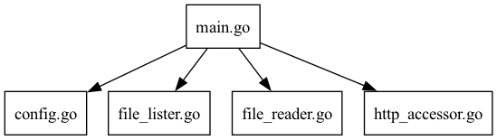

# `link-checker` 
`link-checker` is a tool that looks in a repository and ensures all HTTP links in it are alive.

# Prerequisites
- `git` should be installed
- the current directory should be managed by `git`
- Go >= 1.16 is required

# How to install
Via HomeBrew:
```bash
brew install koba-e964/tap/link-checker
```

From source:
```bash
go install github.com/koba-e964/link-checker@latest
```

# How to run
In the target directory, run:
```bash
link-checker
```

To add a URL to the lock file:
```bash
link-checker add <URL>
```

# Configuration
The configuration file is always placed in `check_links_config.toml` in the project root.

```toml
# how many times link-checker retries before giving up
retry_count = 5
# specifies files which link-checker searches for links 
text_file_extensions = [
    ".c",
    ".cpp",
    ".go",
    ".h",
    ".java",
    ".mod",
    ".md",
    ".py",
    ".rs",
    ".sh",
    ".txt",
]
```

Sometimes you may have to have links that are unstable (e.g., sometimes returns 4xx or 5xx). To handle this issue, `link-checker` allows you to have some exceptions in checking.

```toml
[[ignores]]
url = "https://csrc.nist.gov/pubs/fips/186-4/final"
codes = [200, 404] # allowed codes
reason = """
This URL seems to sometimes return 404 to requests from GitHub Actions' runners,
and the issue cannot be handled with retries."""
# considered_alternatives cannot be empty
considered_alternatives = [
    "https://www.omgwiki.org/dido/doku.php?id=dido:public:ra:xapend:xapend.b_stds:tech:nist:dss", # as flaky as the original
]
```

You can also ignore all URLs that start with a specific prefix:

```toml
[[prefix_ignores]]
prefix = "https://x.com/"
reason = "x.com doesn't seem to allow scraping"
```

## Lock Files

You can create custom rules for specific links using lock files. The lock file is stored in `check_links.lock` in the project root.

To add a URL to the lock file (automatically fetches and computes SHA384 hash):
```bash
link-checker add https://example.com/
```

This will create an entry like:

```toml
[[locks]]
uri = "https://example.com/"
hash_version = "h1"
hash_of_content = "6ca762de9d907c3ec35042bc9a6ed4b5e7096ab89f61997fd277f41549866e7817f1d1daee89fcb8edd938d11bb717e2"
```

# Dependency graph

